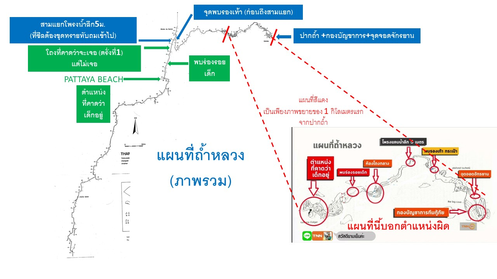

# Tham luang

เว็บนี้ไม่ใช่เว็บทางการ หรือ อยู่หน้าเหตุการณ์จริง  
สิ่งที่อยู่บนเว็บนี้มาจากการคัดกรองมาจากแหล่งที่เชื่อถือได้เท่านั้น

## สถานการณ์ปัจจุบัน เวลา 14.30 น. 28/06/2018

- ยังไม่พบน้องๆ
- ซีลยังไม่ถึงพัทยาบีช

### แถลงข่าวโดยมท.1 เวลา 14.08 น. 28/06/2018 จาก Twitter @mthai

- เมื่อคืนที่ผ่านมาระดับน้ำในถ้ำสูง การสูบน้ำจึงต้องหยุดไประยะหนึ่ง ในตอนนี้กำลังเตรียมการต่อ มีสายไฟแล้ว มีปั๊มน้ำแล้ว จะยังคงสูบน้ำต่อไปเรื่อยๆ เพื่อให้ซีลทีมเข้าด้านในให้ได้
- สิ่งที่น่าเป็นห่วงคือเรื่องของสายไฟ ซึ่งคาดว่า น่าจะมีการติดตั้งสายไฟด้านบนผนังถ้ำ สูบน้ำไปเรื่อยๆ ซึ่งหากเดินสายไฟเรียบร้อย การสูบน้ำจะไปทันที
- หน่วยจากต่างประเทศ มีความเห็นตรงกันว่า ต้องรอจนระดับน้ำลดลงไป จึงจะดำเนินการได้ ระดับน้ำตอนนี้เกือบถึงปากถ้ำแล้ว ซึ่งก็จะมีการสูบออกโดยตลอด ซึ่งการสูบน้ำกับการเดินสายไฟที่จะติดตั้งด้านบนผนังถ้ำ ก็จะดำเนินการไปเลย ไม่รอ
- การสำรวจปล่อง มีอยู่ด้วยกัน 3 จุด เข้าไป ซึ่งทำงานร่วมกับ วิศวกรรมสถาน กรมทรัพยากรธรณี ในการตรวจสอบว่า มันลงไปได้หรือไม่
- นอกจากนี้กรมทรัพยากรธรณีจะทำ profile ของภูเขา ซึ่งเตรียมเครื่องบินเอาไปส่งด้านบน เพื่อให้ดำเนินการได้
- แนวทางอื่นๆ ที่น่าจะพอเป็นไปได้ อีก 2 แนวทาง ของวิศวกรรมสถาน และ กรมทรัพยากรธรณี
- ในทางเลือกคือ การเจาะเข้าไปยังในบริเวณถ้ำ ก็จะต้องเตรียมการเอาเครื่องมือขึ้นไปด้านบน
- ปลายถ้ำ ตอนนี้พอทราบว่า มีน้ำออกมา ซึ่งมีแนวทางในการขยายช่องที่น้ำ ออกบริเวณ ซึ่งกำลังสำรวจกันอยู่
- ที่ดอยผาหมี มีตร. ตชด. กรมอุทยานฯ กำลังสำรวจความเป็นไปได้ ในการค้นหาปล่อง โพรงอยู่เช่นเดิม
- มท.1 ห่วงเรื่องฝน ถ้าแดดออกแบบนี้ ถือว่า ยังพอจัดการได้
- เมื่อวานนี้ อุปกรณ์สำหรับสูบแล้วออกนี้มีจำนวน 20 ชุด ซึ่งข้อจำกัดจะอยู่ที่กำลังไฟที่จะใช้ได้ หากใช้ได้เยอะ ก็จัดชุดสูบได้เยอะ
- ปริมาณน้ำ จากข้อมูลนั้นจะไหลออกมาทางปากถ้ำ ไม่ไปทางท้ายถ้ำ ทีมงานบอกว่า อาจจะเป็นข้อดี คือเมื่อน้ำดึงมาทางหน้าถ้ำ ก็จะมีโอกาสการดึงอากาศเข้าสู่โถงถ้ำเพิ่มขึ้น
- เรื่องการเจาะ เครื่องเจาะนั้นมีน้ำหนักหลายตัน ดังนั้นจะมีข้อจำกัดในการเคลื่อนย้าย ว่าขึ้นไปได้ไหม? วางได้ไหม? เจาะได้ไหม?
- การดำน้ำในทีมร่วมระว่าง ซีล - กู้ภัยต่างชาติ - ประดาน้ำ จะแบ่งงานกันทำ ซึ่งทั้งหมดยืนยันตรงกัน รอให้น้ำลดเท่านั้น
- การบริหารจัดการพื้นที่นั้นจะต้องมีการจัดการเพื่อป้องกันไม่ให้เกิดข่าวลือ ข่าวลวงต่างๆ ซึ่งในการทำงานต้องมีการปรับเปลี่ยนสถานการณ์ไปตามปัญหาหน้างาน คนเก่งๆ ที่นี่เยอะ
- การให้สัมภาษณ์-ให้ข้อมูล ก็จะผ่านทาง ท่านผู้ว่าฯ และท่านรองแม่ทัพภาคเป็นหลัก

## ลิงก์

- [FAQ](./faq) -- รวมคำถามที่ถามกันเยอะ
- [Fake news](./fakes) -- รวมข่าวปลอมที่แชร์กัน
- [แหล่งข่าวที่น่าเชื่อถือ](./news) -- กรุณาติดตามข่าวจากแหล่งพวกนี้

## แผนที่ภาพรวมถ้ำ

## เกี่ยวกับเว็บไซต์

### แก้ไข/เพิ่มข้อมูล

- สมาชิกเว็บ Pantip.com แสดงความคิดเห็นในกระทู้  ได้เลย
- สมาชิก Twitter.com mention มาที่ @ThewDhanat
- สมาชิก Github.com เพิ่ม Issue ได้เลย
