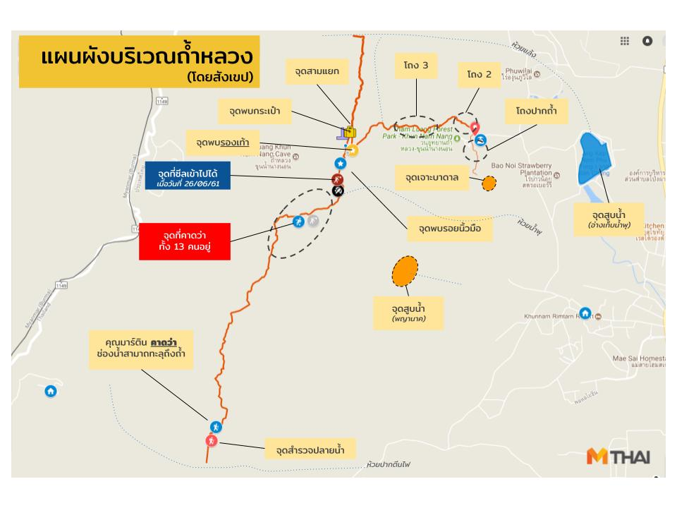

# Tham luang

เว็บนี้ไม่ใช่เว็บทางการ หรือ อยู่หน้าเหตุการณ์จริง  
สิ่งที่อยู่บนเว็บนี้มาจากการคัดกรองมาจากแหล่งที่เชื่อถือได้เท่านั้น

## สถานการณ์ปัจจุบัน เวลา 17.45 น. 02/07/2018

- ยังไม่พบผู้สูญหายทั้ง 13 คน
- ซีลยังไม่ถึงพัทยาบีช -- [อ่านเพิ่มเติม](./faq/รวมคำถามเรื่องแผนที่/)

<blockquote class="twitter-tweet" data-lang="en">
อัพเดท <a href="https://twitter.com/hashtag/%E0%B8%96%E0%B9%89%E0%B8%B3%E0%B8%AB%E0%B8%A5%E0%B8%A7%E0%B8%87?src=hash&amp;ref_src=twsrc%5Etfw">#ถ้ำหลวง</a> จ.เชียงราย 2/07/61  สรุปการแถลงข่าว 1. ยังไม่เจอทั้ง 13 คน 2. ยังไม่ถึงพัทยาบีช 3. ยังไม่เจอรอยอะไรอย่างที่ลือกัน 4. มีแผนเจาะถ้ำจากด้านบน คุมโดยนักธรณีฟิสิกส์ แต่ไม่ยืนยันว่าจะเจอเลยไหม 4. อะไรให้อภัยกันได้ ก็ให้อภัยกันไป เพื่องาน
&mdash; mthai (@mthai) <a href="https://twitter.com/mthai/status/1013732199495958533?ref_src=twsrc%5Etfw">July 2, 2018</a></blockquote>

- ระวังพวก[แอบอ้าง](./fakes/แอบอ้าง)

## ลิงก์

- [FAQ](./faq) -- รวมคำถามที่ถามกันเยอะ
- [Fake news](./fakes) -- รวมข่าวปลอมที่แชร์กัน
- [แถลงข่าว](./statements) -- รวมแถลงข่าว สถานการณ์โดยทางการ
- [ภาพและคลิป](./media) -- จะได้เข้าใจความลำบากของเจ้าหน้าที่
- [แหล่งข่าวที่น่าเชื่อถือ](./news) -- กรุณาติดตามข่าวจากแหล่งพวกนี้

## แผนที่ถ้ำ

_โดย [@mthai](https://twitter.com/mthai/status/1013248965326733312)_

ดูเพิ่มเติมที่ [FAQ รวมคำถามเรื่องแผนที่](./faq/รวมคำถามเรื่องแผนที่/#รวมแผนที่)

## เกี่ยวกับเว็บไซต์

ข้อมูลบางส่วนบางหน้าอาจล่าช้า เพราะสถานการณ์มีความคืบหน้าตลอด ขอให้ดู**วันที่และเวลา**ของข้อมูลต่างๆด้วย  
หากพบข้อมูลผิด ล่าช้า บกพร่อง ขาด ขอให้ทำตามด้านล่างนี้

### การแก้ไข/เพิ่มข้อมูล

- สมาชิกเว็บ Pantip.com แสดงความคิดเห็นในกระทู้ [เกาะติดกู้ภัยครั้งใหญ่ระดับภาค นักฟุตบอลหายไปในถ้ำทั้งทีม 24 ชม.แล้วยังหาไม่เจอ](https://pantip.com/topic/37803852/) ได้เลย
- หรือ เพิ่ม Comment Facebook ด้านล่างนี้
- หรือ สมาชิก Github.com เพิ่ม Issue ได้เลย

