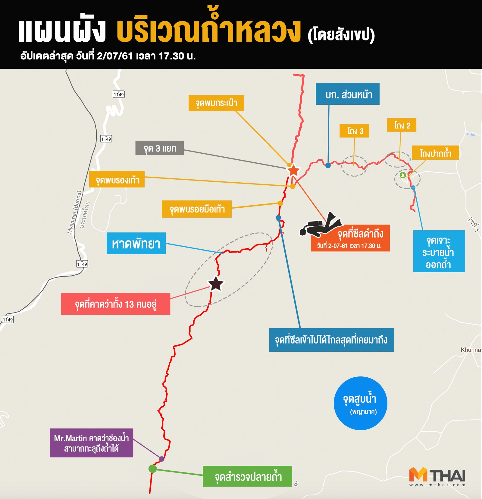

# Tham luang

เว็บนี้ไม่ใช่เว็บทางการ หรือ อยู่หน้าเหตุการณ์จริง  
สิ่งที่อยู่บนเว็บนี้มาจากการคัดกรองมาจากแหล่งที่เชื่อถือได้เท่านั้น

## สถานการณ์ปัจจุบัน เวลา 19.46 น. 08/07/2018

7:00 น. (GTM+7) เชิญญาติเข้าไปประชุมเตรียมพร้อม
9:00 น. (GTM+7) ประกาศเชิญสื่อมวลชนและผู้ไม่มีส่วนเกี่ยวข้องออกจากพื้นที่ 
10:00 น. (GTM+7) ยืนยัน ภารกิจ "นำหมูป่ากลับบ้าน"
14.00 น. (GTM+7) รพ.เชียงรายประชานุเคราะห์ยืนยันความพร้อม จนท. คุมเข้มรพ โดยเฉพาะชั้น 8
14.30 น. (GTM+7) หน่วยแพทย์กองทัพสหรัฐอเมริกา เตรียมเข้าถ้ำหลวง
15:00 น. (GTM+7) ปิดถนนบริเวณ รพ.เชียงรายประชานุเคราะห์ ห้ามสื่อมวลชนบันทึกภาพโดยเด็ดขาดและเชิญบุคคลที่ไม่เกี่ยวข้องออกจากพื้นที่
15:00 น. (GTM+7) - 15:30 น. (GTM+7) ฝนตกบริเวณถ้ำหลวง
18.00 น. (GTM+7) น. ยืนยัน 2 คนแรกของทีมหมูป่าออกมาแล้ว
19.30 น. (GTM+7) น. ฮ.นำส่งผู้ประสบภัยถึงลาน ฮ.กองบิน 416 นำส่ง รพ.เชียงรายประชานุเคราะห์

## ลิงก์

- [รายงานข่าวพบแล้ว](./found/)
- [FAQ](./faq) -- รวมคำถามที่ถามกันเยอะ
- [Fake news](./fakes) -- รวมข่าวปลอมที่แชร์กัน
- [แถลงข่าว](./statements) -- รวมแถลงข่าว สถานการณ์โดยทางการ
- [ภาพและคลิป](./media) -- จะได้เข้าใจความลำบากของเจ้าหน้าที่
- [แหล่งข่าวที่น่าเชื่อถือ](./news) -- กรุณาติดตามข่าวจากแหล่งพวกนี้

## แผนที่ถ้ำ

_โดย [@mthai](https://twitter.com/mthai/status/1013750300597895168)_

ดูเพิ่มเติมที่ [FAQ รวมคำถามเรื่องแผนที่](./faq/รวมคำถามเรื่องแผนที่/#รวมแผนที่)

## เกี่ยวกับเว็บไซต์

ข้อมูลบางส่วนบางหน้าอาจล่าช้า เพราะสถานการณ์มีความคืบหน้าตลอด ขอให้ดู**วันที่และเวลา**ของข้อมูลต่างๆด้วย  
หากพบข้อมูลผิด ล่าช้า บกพร่อง ขาด ขอให้ทำตามด้านล่างนี้

### การแก้ไข/เพิ่มข้อมูล

- สมาชิกเว็บ Pantip.com แสดงความคิดเห็นในกระทู้ [เกาะติดกู้ภัยครั้งใหญ่ระดับภาค นักฟุตบอลหายไปในถ้ำทั้งทีม 24 ชม.แล้วยังหาไม่เจอ](https://pantip.com/topic/37803852/) ได้เลย
- หรือ เพิ่ม Comment Facebook ด้านล่างนี้
- หรือ สมาชิก Github.com เพิ่ม Issue ได้เลย

