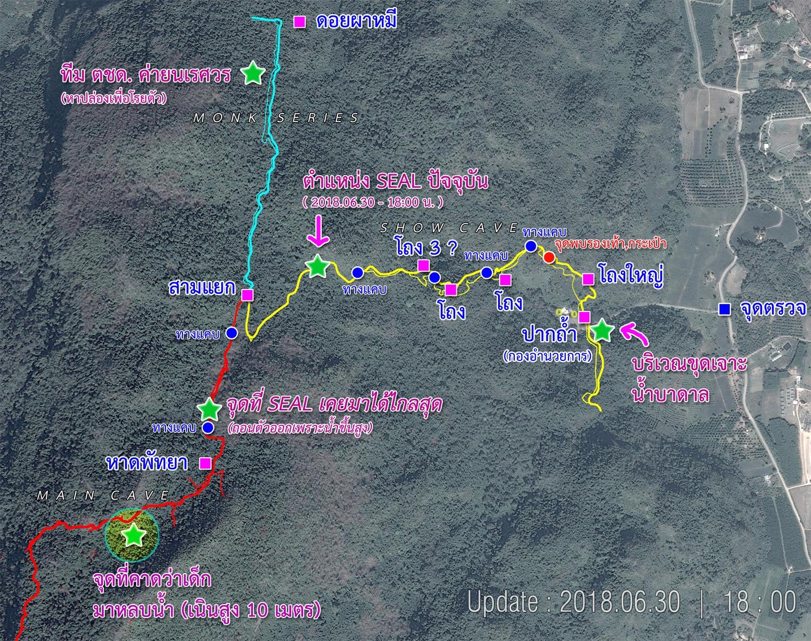
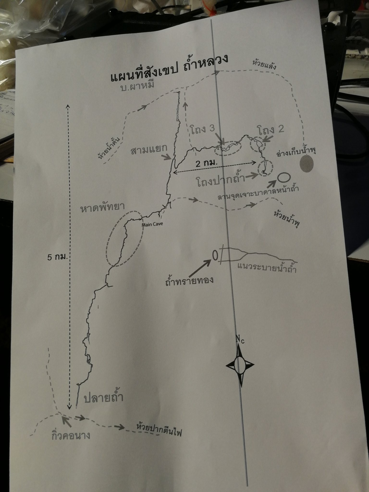

# Tham luang

เว็บนี้ไม่ใช่เว็บทางการ หรือ อยู่หน้าเหตุการณ์จริง  
สิ่งที่อยู่บนเว็บนี้มาจากการคัดกรองมาจากแหล่งที่เชื่อถือได้เท่านั้น

## สถานการณ์ปัจจุบัน เวลา 9.20 น. 01/07/2018

- ยังไม่พบผู้สูญหายทั้ง 13 คน
- ซีลยังไม่ถึงพัทยาบีช -- [อ่านเพิ่มเติม](./faq/รวมคำถามเรื่องแผนที่/)

- [สรุปข่าวคร่าวๆช่วง 01.00 - ปัจจุบัน](https://pantip.com/topic/37803852/comment6003)
- [แผนที่โถงต่างๆตำแหน่งต่างๆในถ้ำ](#แผนที่ถ้ำ)
- [รวมหน่วยที่มาช่วยเหลือ](https://www.facebook.com/cyukol/posts/10150994398849981) โดยสมาชิก Facebook ชื่อ [Chalermchatri Yukol](https://www.facebook.com/cyukol/)

## ลิงก์

- [FAQ](./faq) -- รวมคำถามที่ถามกันเยอะ
- [Fake news](./fakes) -- รวมข่าวปลอมที่แชร์กัน
- [แถลงข่าว](./statements) -- รวมแถลงข่าว สถานการณ์โดยทางการ
- [ภาพและคลิป](./media) -- จะได้เข้าใจความลำบากของเจ้าหน้าที่
- [แหล่งข่าวที่น่าเชื่อถือ](./news) -- กรุณาติดตามข่าวจากแหล่งพวกนี้

## แผนที่ถ้ำ

_โดย [คุณ สมาชิกหมายเลข 2085974](https://pantip.com/topic/37803852/comment5723) สมาชิก Pantip.com_

_โดย [@palm_phattanan](https://twitter.com/palm_phattanan/status/1013061622783344641) ภาพแผนที่ของผู้ว่าฯเชียงราย_

ดูเพิ่มเติมที่ ความคิดเห็นที่ [5743](https://pantip.com/topic/37803852/comment5743)

### แผนที่ Google maps ดูได้ 3 มิติ

_โดยสมาชิก Facebook ชื่อ [Lek Gis](https://www.facebook.com/lekgis)_

[แผนที่ Google maps ดูได้ 3 มิติ](https://www.google.com/maps/d/viewer?mid=1XNbZ-QjjXkKxjtkfiKARvRfdh-JxBi3-)

## เกี่ยวกับเว็บไซต์

ข้อมูลบางส่วนบางหน้าอาจล่าช้า เพราะสถานการณ์มีความคืบหน้าตลอด ขอให้ดู**วันที่และเวลา**ของข้อมูลต่างๆด้วย  
หากพบข้อมูลผิด ล่าช้า บกพร่อง ขาด ขอให้ทำตามด้านล่างนี้

### การแก้ไข/เพิ่มข้อมูล

- สมาชิกเว็บ Pantip.com แสดงความคิดเห็นในกระทู้ [เกาะติดกู้ภัยครั้งใหญ่ระดับภาค นักฟุตบอลหายไปในถ้ำทั้งทีม 24 ชม.แล้วยังหาไม่เจอ](https://pantip.com/topic/37803852/) ได้เลย
- หรือ เพิ่ม Comment Facebook ด้านล่างนี้
- หรือ สมาชิก Github.com เพิ่ม Issue ได้เลย

